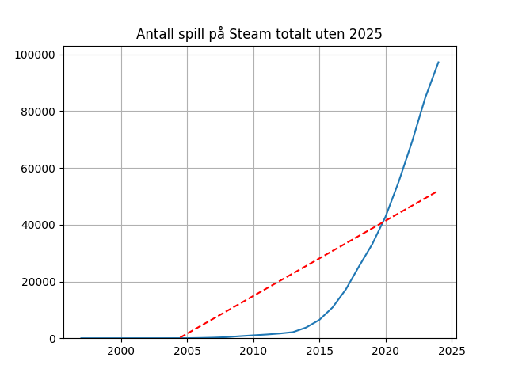
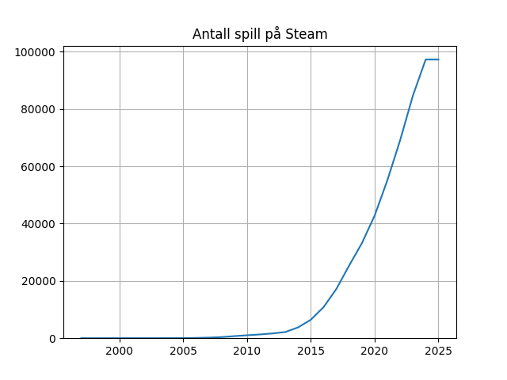
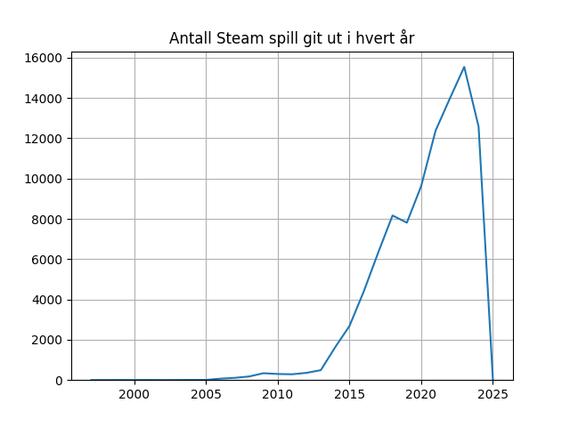
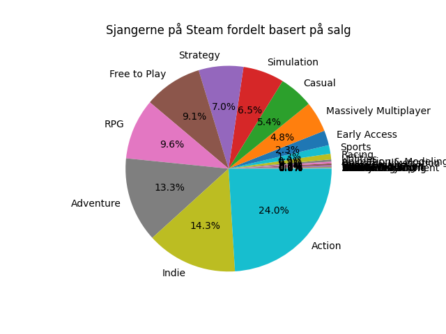
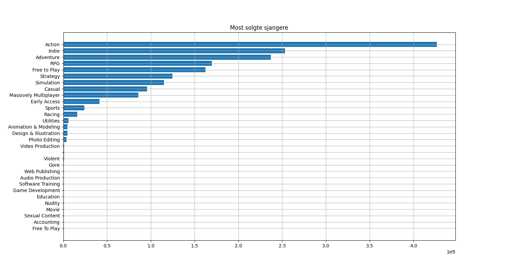
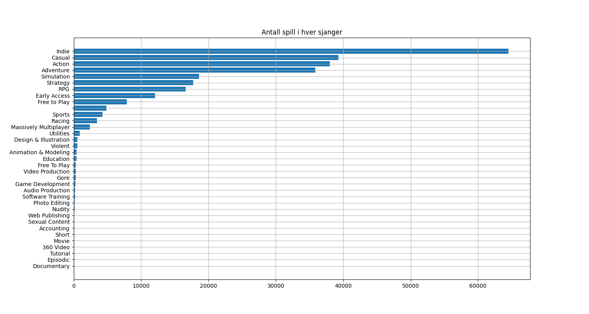
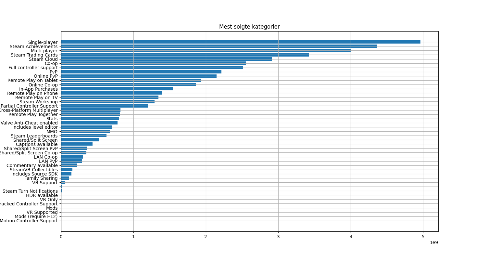
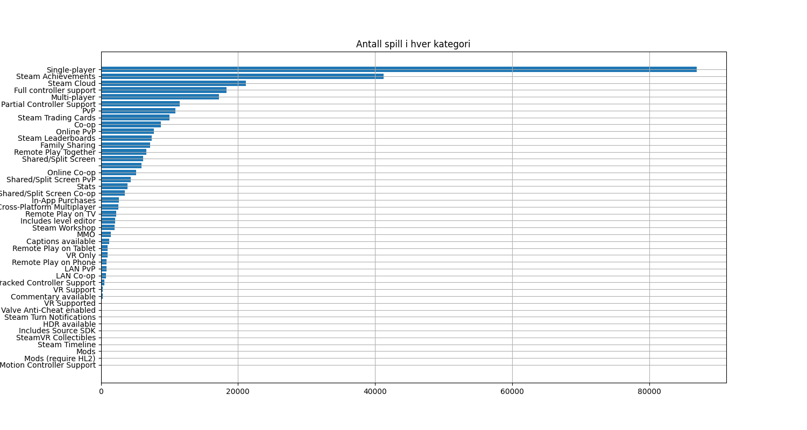
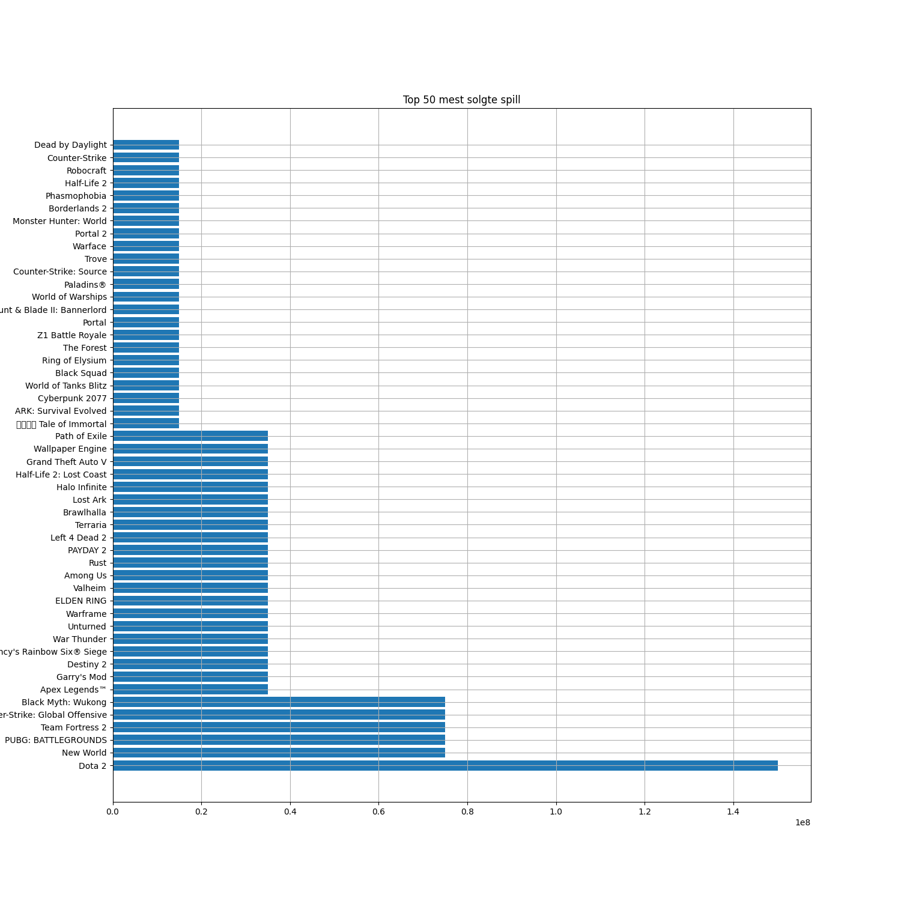
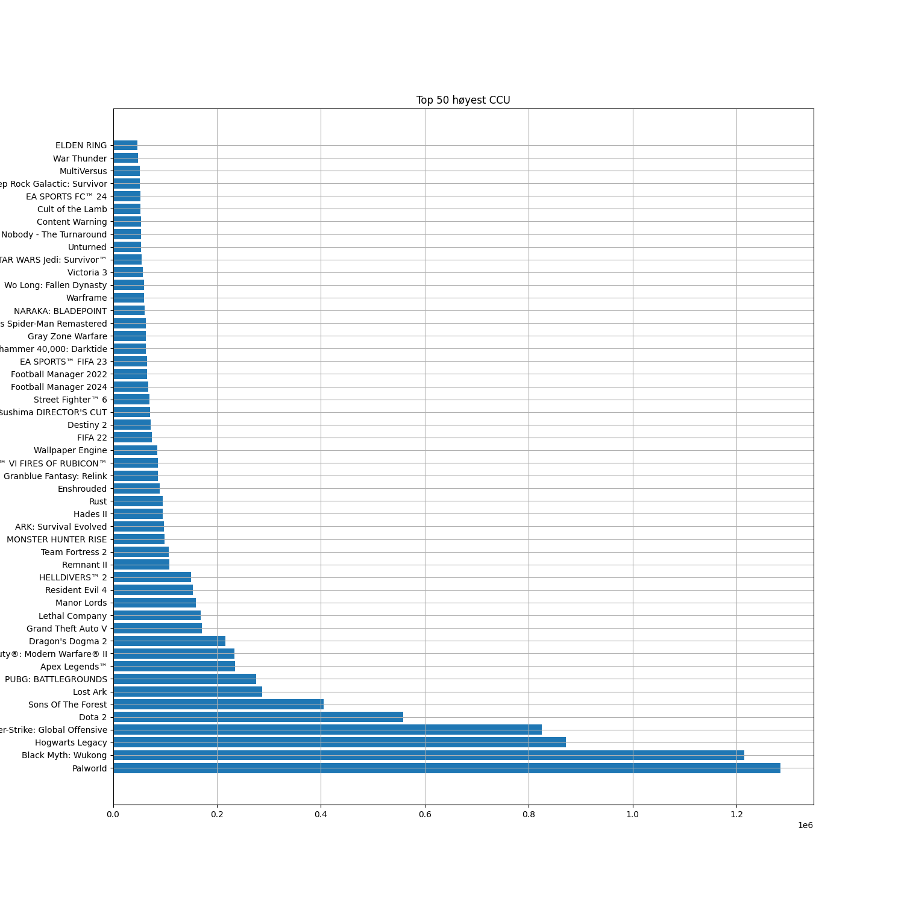

# Steam data

## Spill på Steam

Her ser vi hvordan antall spill på Steam har utbredt seg siden det begynte. Jeg har fjernet 2025 siden det har nettopp begynt og endrer trenden (generert med numpy). Her er grafen med 2025 inkludert:

Vi kan også se på hvor mange spill ble gitt ut hvert år:

## Sjanger og kategori

Det kan også være nyttig å se på hvor hvor mange spill av hver sjanger har blitt kjøpt/gitt ut.

## Største spill

Når vi snakker om spill må vi nevne mest kjøpt spill og spillene med høyest spilletall i samme øyeblikk. Her ser vi mange spill som har samme størelse som kommer fra at dataen hadde bare en estimering, og jeg måtte ta en middelverdi. Dette git mindre nøyaktig data, men jeg kan fremdeles vise frem neon resultater.

